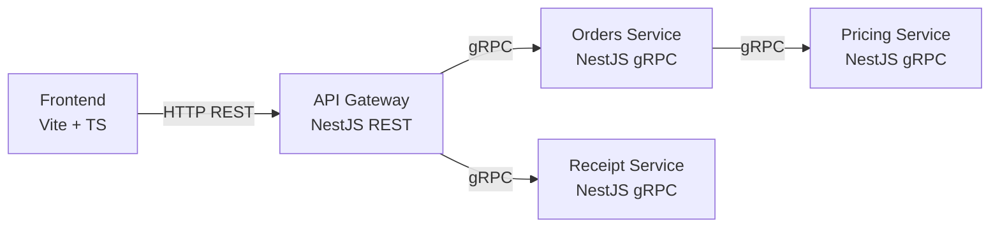

# 📦 QuetzalShip – Práctica 2  
**Software Avanzado – Arquitectura de Microservicios**

---

## 📚 Información General

**Universidad:** Universidad de San Carlos de Guatemala  
**Facultad:** Facultad de Ingeniería  
**Escuela:** Ciencias y Sistemas  
**Área:** Desarrollo de Software  

**Curso:** Software Avanzado  
**Práctica:** 2  
**Nombre del sistema:** QuetzalShip  
**Arquitectura:** Microservicios con API Gateway  

**Tecnologías principales:**  
- NestJS + TypeScript  
- gRPC  
- REST (OpenAPI)  
- Vite + TypeScript  
- Docker & Docker Compose  
- GitHub Actions (CI)

---

## 🧾 Introducción

La presente práctica tiene como objetivo el diseño e implementación de un sistema distribuido denominado **QuetzalShip**, el cual simula una plataforma de gestión de envíos y órdenes logísticas. El sistema permite realizar operaciones completas sobre órdenes de envío, incluyendo su creación, consulta, listado, cancelación y la generación de recibos detallados con el desglose del cálculo tarifario.

Esta práctica representa una evolución directa de la Práctica 1, migrando desde un enfoque monolítico hacia una **arquitectura basada en microservicios**, aplicando principios de separación de responsabilidades, contratos explícitos y comunicación controlada entre componentes.

---

## 🧾 Resumen Ejecutivo

QuetzalShip está compuesto por cinco componentes principales que se ejecutan de forma independiente en contenedores Docker. La comunicación externa se centraliza mediante un **API Gateway**, mientras que la comunicación interna entre servicios se realiza exclusivamente mediante **gRPC**.

El sistema es consumido por un **Frontend SPA** desarrollado con Vite y TypeScript, el cual interactúa únicamente con el Gateway. Todo el entorno puede levantarse localmente con un solo comando utilizando Docker Compose y cuenta con un pipeline de Integración Continua que valida la calidad, contratos y builds del proyecto.

---

## 🎯 Objetivos

### Objetivo General

Construir un sistema distribuido de microservicios para la gestión de órdenes de envío, utilizando tecnologías modernas de backend y frontend, validado mediante contenedores y automatización de procesos de integración continua.

### Objetivos Específicos

- Aplicar correctamente el patrón **API Gateway**.
- Separar responsabilidades de negocio en microservicios independientes.
- Implementar contratos formales mediante OpenAPI y gRPC.
- Asegurar reproducibilidad del entorno con Docker Compose.
- Automatizar validaciones mediante CI en GitHub Actions.
- Implementar resiliencia, manejo de errores e idempotencia.

---

## 🏗️ Arquitectura General del Sistema

El sistema está compuesto por los siguientes componentes:

1. Frontend  
2. API Gateway  
3. Orders Service  
4. Pricing Service  
5. Receipt Service  

Cada componente se ejecuta en su propio contenedor y cumple una función específica dentro del dominio del sistema.

---

## 🧭 Diagrama de Arquitectura

flowchart LR
    Frontend -->|HTTP REST| Gateway
    Gateway -->|gRPC| Orders
    Orders -->|gRPC| Pricing
    Gateway -->|gRPC| Receipt

## 🧠 Decisiones de Diseño Arquitectónico

Durante el desarrollo de QuetzalShip se tomaron diversas decisiones de diseño con el objetivo de mantener una arquitectura clara, escalable y alineada con los principios de microservicios.

Una de las decisiones principales fue la implementación del **patrón API Gateway**, el cual centraliza el acceso al backend y evita que el frontend tenga conocimiento directo de los microservicios internos. Esta decisión simplifica el consumo de la API y permite encapsular la complejidad del sistema distribuido.

Asimismo, se decidió utilizar **gRPC** para la comunicación interna entre microservicios debido a su eficiencia, tipado fuerte mediante archivos `.proto` y facilidad para definir contratos claros entre servicios. Esto reduce errores de integración y mejora la mantenibilidad del sistema.

---

## 📐 Separación de Responsabilidades

Cada microservicio fue diseñado con una única responsabilidad clara:

- **Orders Service** se encarga únicamente de la gestión del ciclo de vida de las órdenes.
- **Pricing Service** concentra toda la lógica de cálculo tarifario, evitando duplicación de reglas.
- **Receipt Service** genera recibos estables sin recalcular información.
- **Gateway** orquesta la comunicación y maneja validaciones y errores.
- **Frontend** se limita a la presentación y consumo de la API.

Esta separación permite que cada componente evolucione de forma independiente y reduce el acoplamiento entre módulos.

---

## 🧪 Estrategia de Pruebas

Las pruebas unitarias fueron diseñadas para cubrir los puntos críticos del sistema, especialmente aquellos relacionados con reglas de negocio sensibles, como el cálculo tarifario y la transición de estados de las órdenes.

El **Pricing Service** cuenta con pruebas que validan escenarios normales y casos límite, como descuentos máximos y totales que no pueden ser negativos.  
El **Orders Service** valida el correcto almacenamiento del desglose y el manejo de cancelaciones.  
El **Gateway** verifica la validación de payloads inválidos.

La ejecución automática de pruebas en el pipeline de CI asegura que los cambios no rompan funcionalidades existentes.

---

## ⚙️ Manejo de Configuración

La configuración del sistema se realiza mediante **variables de entorno**, lo que permite adaptar fácilmente el comportamiento del sistema a diferentes entornos (desarrollo, pruebas o producción).

Ejemplos de configuraciones incluyen:
- URL base del Gateway para el frontend.
- Timeouts de llamadas gRPC.
- Puertos expuestos por cada servicio.
- Configuración de Docker y Docker Compose.

Este enfoque evita configuraciones rígidas y facilita la portabilidad del sistema.

---

## 🔄 Consideraciones de Escalabilidad

Aunque el sistema utiliza persistencia en memoria por requerimientos de la práctica, la arquitectura propuesta permite una futura migración hacia bases de datos persistentes sin modificar el contrato externo.

De igual forma, los microservicios pueden escalarse horizontalmente de manera independiente, especialmente el **Pricing Service**, que podría recibir una alta carga de solicitudes en un escenario real.

---

## 🚧 Limitaciones Conocidas

- La persistencia en memoria implica pérdida de datos al reiniciar los servicios.
- No se implementa autenticación ni autorización.
- El sistema está enfocado en fines académicos y no productivos.
- No se maneja concurrencia avanzada en la creación de órdenes.

Estas limitaciones son aceptables dentro del alcance definido para la práctica.

---

## 📈 Aprendizajes Obtenidos

El desarrollo de esta práctica permitió reforzar conceptos clave como:
- Diseño de arquitecturas distribuidas.
- Uso de contratos explícitos.
- Contenerización de aplicaciones completas.
- Automatización de validaciones mediante CI.
- Manejo de errores en sistemas distribuidos.

Además, se adquirió experiencia práctica en la integración de múltiples tecnologías modernas utilizadas actualmente en la industria del software.

---

## 🏁 Reflexión Final

La Práctica 2 de Software Avanzado representa un ejercicio integral que combina arquitectura, desarrollo, pruebas y automatización. La implementación de QuetzalShip evidencia la importancia de diseñar sistemas bien estructurados desde el inicio y demuestra cómo los microservicios pueden ser utilizados de manera efectiva cuando se aplican buenas prácticas de ingeniería de software.

---

## 🚀 Trabajo Futuro y Posibles Mejoras

El sistema QuetzalShip fue diseñado teniendo en cuenta la posibilidad de evolución y mejora continua. Aunque cumple completamente con los requerimientos establecidos para la práctica, existen múltiples áreas que podrían ampliarse en un escenario real o productivo.

Una de las mejoras más relevantes sería la incorporación de un sistema de **persistencia permanente**, utilizando bases de datos relacionales o NoSQL. Esto permitiría mantener la información de las órdenes incluso después de reiniciar los servicios, mejorando la confiabilidad del sistema.

Otra mejora importante sería la implementación de **autenticación y autorización**, utilizando mecanismos como JWT o OAuth2. Esto permitiría controlar el acceso a las operaciones del sistema y manejar distintos roles de usuario.

---

## 🔐 Seguridad y Buenas Prácticas

En un entorno productivo, sería recomendable integrar medidas de seguridad adicionales, como:
- Validación estricta de entradas para prevenir ataques.
- Uso de HTTPS para todas las comunicaciones externas.
- Manejo seguro de secretos mediante herramientas especializadas.
- Auditoría y monitoreo de eventos críticos del sistema.

Estas prácticas ayudarían a fortalecer la robustez y confiabilidad del sistema.

---

## 📊 Observabilidad y Monitoreo

Una futura versión del sistema podría incluir herramientas de **observabilidad**, tales como:
- Logs centralizados por servicio.
- Métricas de rendimiento (latencia, throughput).
- Monitoreo de salud de servicios.
- Alertas ante fallos o degradación.

Esto facilitaría la detección temprana de problemas y el análisis de comportamiento del sistema en producción.

---

## 🧩 Evolución de la Arquitectura

La arquitectura basada en microservicios utilizada en QuetzalShip permite realizar cambios graduales sin afectar todo el sistema. Cada microservicio puede evolucionar de forma independiente, facilitando el mantenimiento y la incorporación de nuevas funcionalidades.

Por ejemplo, el Pricing Service podría ampliarse para soportar múltiples esquemas tarifarios o promociones dinámicas, mientras que el Orders Service podría integrar nuevos estados o flujos de negocio.

---

## 📚 Impacto Académico

El desarrollo de esta práctica tiene un alto valor académico, ya que permite aplicar de manera integrada conceptos de arquitectura de software, diseño de sistemas distribuidos y automatización de procesos.

La experiencia adquirida en esta práctica sirve como base para proyectos más complejos y acerca al estudiante a escenarios reales utilizados en la industria del software.

---

## 🏁 Cierre del Proyecto

En conclusión, QuetzalShip representa una solución completa y bien estructurada para la gestión de órdenes de envío dentro del alcance definido. La práctica demuestra la correcta aplicación de principios de microservicios, contratos bien definidos y buenas prácticas de desarrollo, cumpliendo satisfactoriamente con los objetivos del curso Software Avanzado.

---

## 🏗️ Comparación entre Arquitectura Monolítica y Microservicios

Durante el desarrollo de QuetzalShip fue posible observar claramente las diferencias entre un enfoque monolítico y uno basado en microservicios. Mientras que en un sistema monolítico toda la lógica se encuentra centralizada en una sola aplicación, en esta práctica cada responsabilidad se encuentra separada en servicios independientes.

La arquitectura de microservicios permite una mayor modularidad, ya que cada servicio puede desarrollarse, probarse y desplegarse de manera independiente. Esto facilita el mantenimiento del sistema y reduce el impacto de cambios futuros.

Sin embargo, también introduce nuevos retos, como la necesidad de manejar comunicación entre servicios, latencia, manejo de errores distribuidos y complejidad operativa. Estas consideraciones fueron abordadas mediante el uso de gRPC, timeouts, retries controlados y un API Gateway como punto de orquestación.

---

## 🔁 Flujo Completo de una Orden

El flujo completo de una orden inicia cuando el usuario interactúa con el frontend y envía una solicitud de creación de orden al API Gateway. El Gateway valida el payload de entrada utilizando el contrato OpenAPI y verifica la idempotencia de la solicitud.

Posteriormente, el Gateway delega la creación de la orden al Orders Service mediante gRPC. El Orders Service, a su vez, solicita al Pricing Service el cálculo tarifario correspondiente, el cual retorna un desglose detallado y determinista.

Una vez obtenido el cálculo, el Orders Service almacena la orden en memoria junto con su desglose y total, y retorna la información al Gateway, quien finalmente responde al frontend. Este flujo garantiza consistencia, separación de responsabilidades y trazabilidad.

---

## 📄 Generación de Recibos

La generación de recibos se realiza bajo el principio de **inmutabilidad**. El Receipt Service no recalcula valores ni modifica información, sino que se basa estrictamente en los datos previamente almacenados en la orden.

Este enfoque asegura que el recibo generado siempre coincida exactamente con el total y desglose original, evitando inconsistencias y errores derivados de recálculos posteriores.

---

## ⚙️ Manejo de Estados de la Orden

Las órdenes en QuetzalShip manejan un conjunto limitado de estados definidos, lo cual simplifica el control del flujo de negocio. Una orden inicia en estado `ACTIVE` y puede transicionar a `CANCELLED`.

Una vez cancelada, la orden no puede volver a un estado activo ni ser cancelada nuevamente. Este comportamiento es validado tanto a nivel de lógica del Orders Service como mediante el manejo de errores apropiados en el Gateway.

---

## 🧯 Manejo de Fallos en Sistemas Distribuidos

El sistema fue diseñado considerando la posibilidad de fallos parciales. Si un microservicio interno no está disponible, el Gateway captura el error gRPC correspondiente y lo traduce a una respuesta HTTP coherente para el frontend.

Esto evita exponer detalles internos del sistema y mejora la experiencia del usuario final, quien recibe mensajes de error claros y controlados.

---

## 📦 Gestión de Contenedores

El uso de Docker permite encapsular cada servicio junto con sus dependencias, asegurando que el sistema se ejecute de manera consistente en cualquier entorno.

Docker Compose facilita la orquestación local de los servicios, permitiendo levantar todo el sistema con un solo comando y sin configuraciones manuales adicionales.

---

## 🧑‍💻 Organización del Código

La estructura del repositorio sigue una organización clara por servicio, lo que facilita la navegación y comprensión del proyecto. Cada servicio mantiene su propio conjunto de configuraciones, dependencias y pruebas, reforzando la independencia entre componentes.

Esta organización también favorece el trabajo colaborativo, ya que diferentes miembros del equipo pueden trabajar en servicios distintos sin generar conflictos constantes.

---

## 🎓 Valor Educativo del Proyecto

La implementación de QuetzalShip representa un ejercicio práctico integral que combina múltiples áreas del desarrollo de software moderno. A través de esta práctica, se refuerzan conocimientos de arquitectura, comunicación entre servicios, automatización y buenas prácticas de ingeniería.

El proyecto sirve como una base sólida para comprender cómo se diseñan y mantienen sistemas distribuidos en entornos reales, acercando al estudiante a escenarios utilizados actualmente en la industria.

# QuetzalShip – Práctica 2  
**Software Avanzado – Universidad de San Carlos de Guatemala**

## 📌 Descripción General
QuetzalShip es un sistema distribuido de gestión de envíos implementado bajo una
arquitectura de **microservicios**, orquestados mediante un **API Gateway** y
consumidos por un **Frontend SPA**.

El sistema permite:
- Crear órdenes de envío
- Listar y consultar órdenes
- Cancelar órdenes
- Generar recibos con desglose tarifario exacto

Toda la solución es reproducible localmente mediante **Docker Compose** y validada
con **CI en GitHub Actions**.

---

## 🧱 Arquitectura

- **Frontend**: Vite + TypeScript
- **API Gateway**: NestJS (REST + OpenAPI)
- **Orders Service**: NestJS (gRPC)
- **Pricing Service**: NestJS (gRPC)
- **Receipt Service**: NestJS (gRPC)

### 📊 Diagrama de Arquitectura



---

## 📑 Contratos

### REST (Gateway)
- OpenAPI disponible en:
```
contracts/openapi/quetzalship-gateway.yaml
```

Endpoints principales:
- `POST /v1/orders`
- `GET /v1/orders`
- `GET /v1/orders/{id}`
- `POST /v1/orders/{id}/cancel`
- `GET /v1/orders/{id}/receipt`

### gRPC (Interno)
Protofiles:
```
contracts/proto/
 ├── orders.proto
 ├── pricing.proto
 └── receipt.proto
```

---

## ⚙️ Reglas de Cálculo (Pricing Service)

- Peso volumétrico: `(h × w × l) / 5000`
- Peso tarifable: `max(real, volumétrico)`
- Tarifas por zona:
  - METRO: Q8/kg
  - INTERIOR: Q12/kg
  - FRONTERA: Q16/kg
- Multiplicadores:
  - STANDARD: 1.00
  - EXPRESS: 1.35
  - SAME_DAY: 1.80
- Recargos:
  - Frágil: Q7 por paquete
  - Seguro: 2.5% del valor declarado
- Descuentos:
  - PERCENT (máx. 35%)
  - FIXED (piso 0.00)
- Redondeo a **2 decimales**

---

## 🐳 Docker

### Ejecución local
```bash
docker compose up --build
```

### Servicios expuestos
| Servicio   | Puerto |
|-----------|--------|
| Frontend  | 5173   |
| Gateway   | 3000   |

Los microservicios gRPC permanecen en red interna.

---

## 🔁 CI – GitHub Actions

Workflow:
```
.github/workflows/ci.yml
```

Jobs:
- **quality**: lint, tests, build frontend
- **contracts**: OpenAPI + proto compile
- **docker-build**: build de imágenes
- **docker-push**: push en main y release/**

### 🏷️ Tags de imágenes
- `main-<short_sha>`
- `main-latest`
- `vX.Y.Z` (release)

---

## 🧪 Pruebas

- Pricing: reglas completas de cálculo
- Orders: creación y cancelación
- Gateway: validaciones REST
- Frontend: build exitoso con Vite

---

## 📁 Estructura del Proyecto

```
.
├── services/
│   ├── frontend/
│   ├── gateway/
│   ├── orders/
│   ├── pricing/
│   └── receipt/
├── contracts/
│   ├── openapi/
│   └── proto/
├── docker-compose.yml
├── README.md
├── INTEGRANTES.md
```

---

## 👥 Integrantes

Ver archivo `INTEGRANTES.md`

---

## 🏁 Entrega

- Tag final: `P2-DELIVERY`
- Repositorio accesible en GitHub
