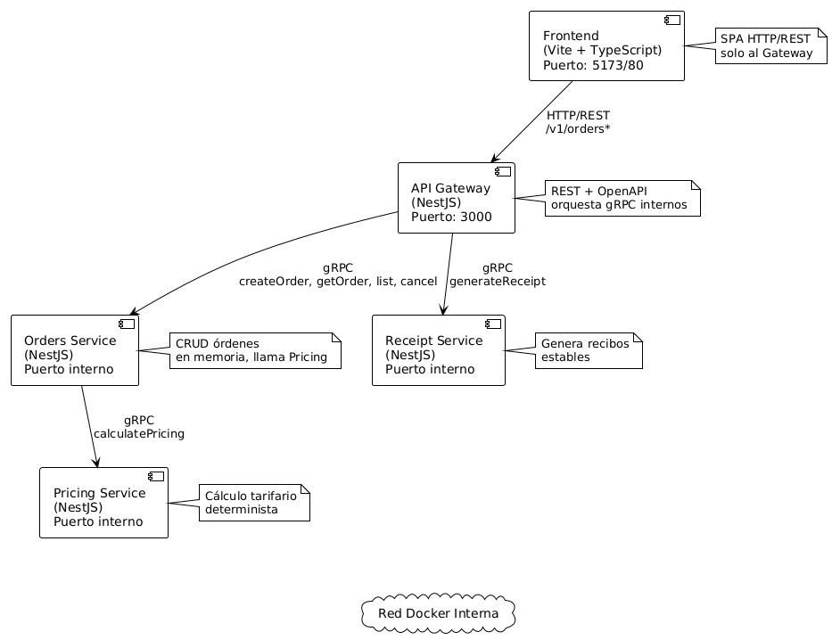

# Integrantes
• Melvin Alexander Valencia Estrada / 202111556 
• Erick Enrique González Chávez / 201900621 
• Dilan Conaher Suy Miranda / 201801194 
• Juan Sebastian Higueros de Leon / 201807344 
• María Isabel Masaya Córdova / 201800565 

# Diagrama

# Calculos de centavos
 1. Cálculos intermedios
    - Se calculan:
      * baseSubtotal  = orderBillableKg * rate
      * serviceSubtotal = baseSubtotal * multiplier
      * fragileSurcharge = 7Q por paquete frágil
      * insuranceSurcharge = 2.5% del total declarado si insurance_enabled = true
      * subtotalWithSurcharges = serviceSubtotal + recargos
      * discountAmount según tipo (PERCENT o FIXED) con tope del 35% para PERCENT.
    - Todos estos valores se mantienen como números (float) durante el cálculo. [file:1]

 2. Cálculo del total
    - total = subtotalWithSurcharges - discountAmount
    - Si total < 0, se fuerza a 0 para cumplir la regla de que el total
      nunca puede ser negativo. [file:1]

 3. Redondeo a 2 decimales
    - Antes de retornar la respuesta gRPC, se redondea:
      * total = Math.round(total * 100) / 100
      * Cada componente del breakdown también se redondea con la misma fórmula:
        - base_subtotal
        - service_subtotal
        - fragile_surcharge
        - insurance_surcharge
        - subtotal_with_surcharges
        - discount_amount
    - Esto garantiza que los valores mostrados al frontend estén
      siempre con 2 decimales y que los desgloses coincidan con el total. [file:1]

 4. Consideración para centavos
    - Aunque no se usa un entero explícito de centavos en esta versión,
      la estrategia documentada es: todos los importes expuestos al
      exterior respetan el redondeo a 2 decimales mediante la operación
      Math.round(valor * 100) / 100. [file:1]

# Comando de ejecución

docker compose up --build

 Imagenes

services:
  frontend:
    image: quetzalship-frontend:main
    build:
      context: .
      dockerfile: services/frontend/Dockerfile

  gateway:
    image: quetzalship-gateway:main
    build:
      context: .
      dockerfile: services/gateway/Dockerfile

  orders:
    image: quetzalship-orders:main
    build:
      context: .
      dockerfile: services/orders/Dockerfile

  pricing:
    image: quetzalship-pricing:main
    build:
      context: .
      dockerfile: services/pricing/Dockerfile

  receipt:
    image: quetzalship-receipt:main
    build:
      context: .
      dockerfile: services/receipt/Dockerfile

      
# 1. VERIFICAR si kibana_system existe (probablemente NO)
curl -u elastic:strongpassword123 http://localhost:9200/_security/user/kibana_system

# 2. SI falla → CREARLO con setup
docker compose --profile setup up setup

# 3. Verificar creado
curl -u elastic:strongpassword123 http://localhost:9200/_security/user/kibana_system

# 4. Generar claves de encriptación (IMPORTANTE para Fleet)
docker compose --profile setup up kibana-genkeys

# 5. Reiniciar Kibana
docker compose restart kibana

# Buildings

docker build -t pricing:latest -f services/pricing/Dockerfile --build-arg SERVICE_NAME=pricing   .
docker push 11erick21/pricing:2.0

docker build -f services/receipt/Dockerfile --build-arg SERVICE_NAME=receipt -t 11erick21/receipt:2.0 .
docker push 11erick21/receipt:2.0

docker build -f services/orders/Dockerfile -t 11erick21/orders:2.0 .
docker push 11erick21/orders:2.0