# DOCUMENTACIÓN DE ARQUITECTURA Y OPERACIÓN (3.6)
## Sistema EconoMarket

---

### Asignatura: Arquitectura de Software / DevOps  
### Proyecto: EconoMarket  
### Tecnologías: Kubernetes, Microservicios, JWT, CI/CD  
### Fecha: 2025-12-22  

---

## 1. Introducción

El presente documento describe la arquitectura, operación y estrategia de entrega del sistema **EconoMarket**.
La documentación cumple con los requisitos establecidos en el apartado **3.6 – Documentación de arquitectura y operación**,
abarcando el despliegue en Kubernetes, la seguridad JWT, el flujo CI/CD y las decisiones técnicas adoptadas.

---

## 2. Vista de Despliegue en Kubernetes

### 2.1 Diagrama de Arquitectura

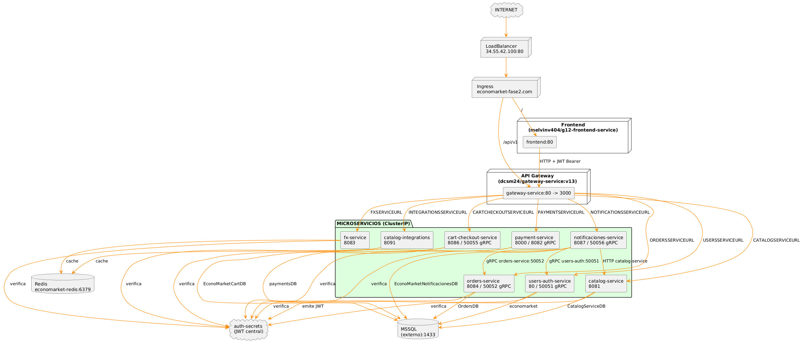

---

### 2.2 Deployments y Responsabilidades

- **frontend**
  - Aplicación web EconoMarket.
  - Consume la API pública del gateway.
  - Expuesta externamente mediante Ingress.

- **gateway**
  - API Gateway / BFF.
  - Expone la API pública `/api/v1`.
  - Orquesta llamadas a los microservicios internos.

- **users-auth-service**
  - Servicio de autenticación.
  - Emite y valida tokens JWT.
  - Autoridad central de identidad.

- **cart-checkout-service**
  - Gestión de carrito y checkout.
  - Requiere JWT.
  - Base de datos propia.

- **orders-service**
  - Gestión de órdenes.
  - Integra carrito, catálogo y usuarios.

- **payment-service**
  - Procesamiento de pagos.
  - Requiere JWT y persiste información de pagos.

- **catalog-service**
  - Catálogo interno de productos.

- **catalog-integrations**
  - Integración con catálogos externos.
  - Cachea resultados.

- **fx-service**
  - Servicio de tipos de cambio.
  - Utiliza Redis como caché.

- **notificaciones-service**
  - Envío de notificaciones de negocio.

- **economarket-redis**
  - Caché compartida para FX e integraciones.

---

### 2.3 Servicios Internos y Comunicación

Todos los microservicios internos se exponen mediante **Services ClusterIP**,
permitiendo comunicación interna segura vía DNS del clúster:

```
http://users-auth-service
http://cart-checkout-service
```

Ningún microservicio interno es accesible directamente desde Internet.

---

### 2.4 Acceso Externo (Ingress y LoadBalancer)

El acceso externo al sistema se realiza mediante un **Ingress Controller**.

- El **Ingress** enruta las peticiones hacia:
  - `/` → frontend
  - `/api/v1` → gateway

- El **Service tipo LoadBalancer** existe únicamente para exponer el Ingress Controller,
no los microservicios directamente.

Este enfoque reduce la superficie de ataque y centraliza el control del tráfico.

---

### 2.5 Flujo de Conexión

```
Usuario → Frontend → Ingress → Gateway → Microservicios
```
---

## 3. Estrategia de Seguridad JWT

### 3.1 Emisión de Tokens

El único servicio autorizado a emitir tokens JWT es **users-auth-service**.

Endpoints públicos:
- `POST /api/v1/auth/login`
- `POST /api/v1/auth/register`

Proceso:
1. Validación de credenciales.
2. Generación del JWT.
3. Firma con clave almacenada en Kubernetes Secrets.
4. Retorno del token al frontend.

---

### 3.2 Validación de Tokens

Todos los servicios de negocio validan el JWT mediante middleware:

- gateway
- cart-checkout-service
- orders-service
- payment-service
- catalog-service
- catalog-integrations
- notificaciones-service

Validaciones:
- Firma
- Expiración
- Claims mínimos

Header esperado:
```
Authorization: Bearer <jwt>
```

---

### 3.3 Endpoints Públicos y Protegidos

**Públicos**
- `/api/v1/auth/login`
- `/api/v1/auth/register`
- `/health`

**Protegidos**
- `/api/v1/cart/**`
- `/api/v1/orders/**`
- `/api/v1/catalog/**`
- `/api/v1/payments/**`
- `/api/v1/notifications/**`
- `/api/v1/integrations/**`

---

### 3.4 Rol del Frontend

- El frontend almacena el JWT en `localStorage` o `sessionStorage`.
- Un interceptor HTTP adjunta el token automáticamente.
- Las vistas administrativas (gestión de productos) requieren un usuario con **rol ADMIN**
  validado mediante JWT.

---

## 4. Estrategia de Entrega (CI/CD)

### 4.1 Integración Continua

Se utiliza **GitHub Actions** para CI.

Etapas:
1. Build
2. Test
3. Push de imágenes Docker a DockerHub

---

---

### 4.2 Publicación en Registry (3.4.2)

El sistema utiliza **DockerHub** como registry de imágenes de contenedores.

- **Registry**: DockerHub  
- **Namespace**: `melvinv404`  
- **Visibilidad**: Pública  

Las imágenes Docker son construidas durante el pipeline de CI y publicadas
automáticamente en DockerHub utilizando credenciales almacenadas como secretos
en GitHub Actions.

### Convención de nombres de imágenes

Todas las imágenes Docker siguen una convención homogénea que permite
identificar claramente el servicio, el propietario y la versión:

```
<registry>/<usuario>/<servicio>:<versión>
```
**Ejemplo**:

```
-docker.io/melvinv404/g12-cart-checkout-service:latest
```
Esta convención se aplica a todos los microservicios desplegados en el clúster Kubernetes.


#### Imágenes publicadas

Las imágenes actualmente publicadas y utilizadas por el clúster Kubernetes son:

- `melvinv404/g12-gateway-service:latest`
- `melvinv404/g12-frontend-service:latest`
- `melvinv404/g12-users-auth-service:latest`
- `melvinv404/g12-cart-checkout-service:latest`
- `melvinv404/g12-orders-service:latest`
- `melvinv404/g12-payment-service:latest`
- `melvinv404/g12-catalog-service:latest`
- `melvinv404/g12-integrations-service:latest`
- `melvinv404/g12-fx-service:latest`
- `melvinv404/g12-notificaciones-service:latest`

Estas imágenes corresponden directamente a los microservicios desplegados
en el clúster.

#### Autenticación del pipeline contra el registry

El pipeline de CI/CD se autentica contra DockerHub utilizando secretos
configurados a nivel de repositorio:

- `DOCKERHUB_USERNAME`
- `DOCKERHUB_TOKEN`

Estos secretos permiten realizar el login seguro y el push de imágenes
sin exponer credenciales en el código fuente.

#### Relación con Kubernetes

Las imágenes publicadas en el registry son referenciadas directamente en los
manifiestos de Kubernetes mediante el campo `image` de los Deployments.

Ejemplo:

```yaml
containers:
  - name: g12-cart-checkout-service
    image: melvinv404/g12-cart-checkout-service:latest
```

### 4.3 Despliegue

El despliegue al clúster Kubernetes se realiza de forma **manual**:

```
kubectl set image deployment/cart-checkout   g12-cart-checkout-service=melvinv404/g12-cart-checkout-service:latest
```

Esta decisión prioriza control y trazabilidad en esta fase académica.

---

### 4.4 Rollback


Kubernetes permite rollback inmediato:

```
kubectl rollout history deployment/cart-checkout
kubectl rollout undo deployment/cart-checkout
```

---

## 5. Supuestos y Decisiones Clave

### 5.1 Rendimiento

- API Gateway único.
- Comunicación interna mediante ClusterIP.
- Redis como caché compartido.
- Requests y limits configurados.

---

### 5.2 Seguridad

- Emisión centralizada de JWT.
- Uso de Kubernetes Secrets.
- Servicios internos no expuestos.
- Acceso externo únicamente vía Ingress.

---

### 5.3 Recursos y Operación

- Endpoints `/health` utilizados como base para **liveness y readiness probes**.
- Kubernetes recrea automáticamente pods ante fallos.

---

## 6. Guía para Reproducir el Despliegue y Pruebas
### 6.1 Requisitos Previos

```
-Docker instalado

-Acceso a un clúster Kubernetes

-kubectl configurado

-Acceso a DockerHub
```

### 6.2 Despliegue del Sistema

```
docker build -t melvinv404/g12-cart-checkout-service:latest .
docker push melvinv404/g12-cart-checkout-service:latest

kubectl set image deployment/cart-checkout \
  g12-cart-checkout-service=melvinv404/g12-cart-checkout-service:latest
```

6.3 Pruebas del Sistema

Health check:
```
curl http://cart-checkout-service:8086/health
```

Endpoint protegido:

curl -H "Authorization: Bearer <jwt>" \
  http://gateway/api/v1/orders

---

## 7. Anexos

### 7.1 Comandos de Verificación

```
kubectl get pods
kubectl get services
kubectl describe deployment cart-checkout
```

---

### 7.2 Health Check

```
curl http://cart-checkout-service:8086/health
```

---

### 7.3 Ejemplo de Petición Autenticada

```
curl -H "Authorization: Bearer <jwt>" http://gateway/api/v1/orders
```

## 8. Evidencias Visuales

### 8.1 Catálogo de Productos
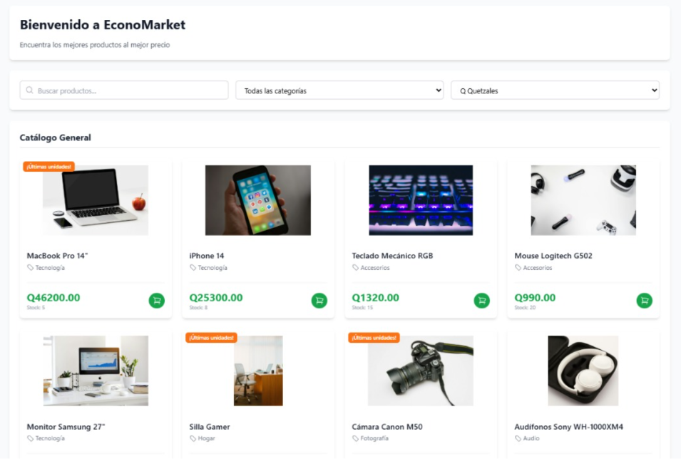

### 8.2 Carrito de Compras
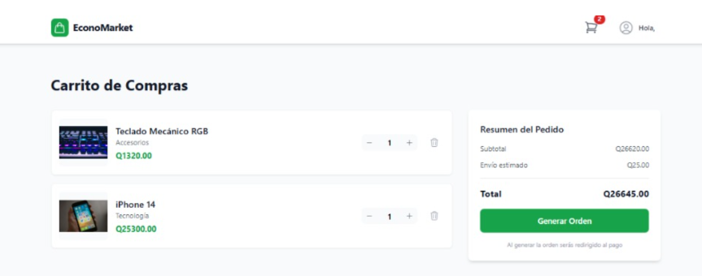

### 8.3 Gestión de Productos (Admin)
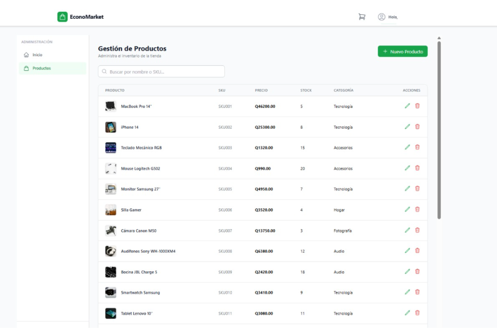
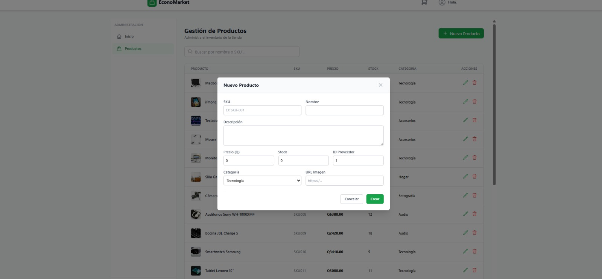
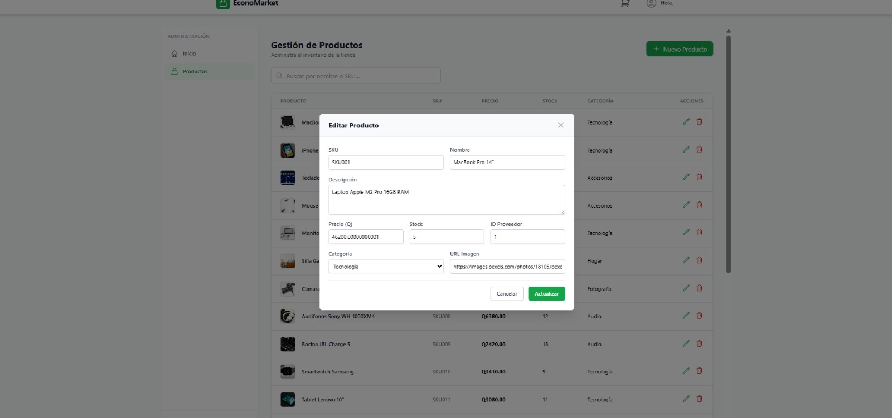

### 8.4 Logs y Health Checks
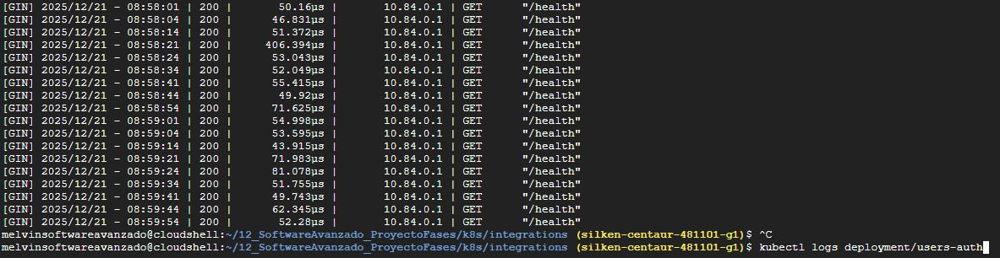
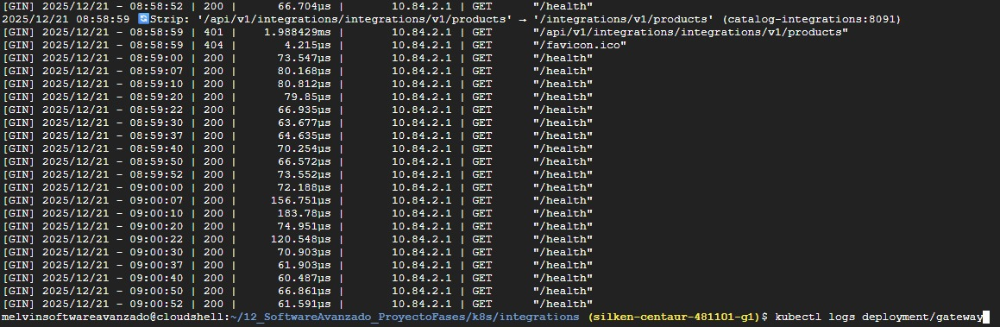
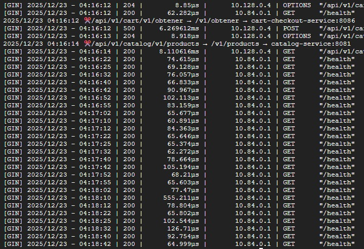

### 8.5 Estado de Pods
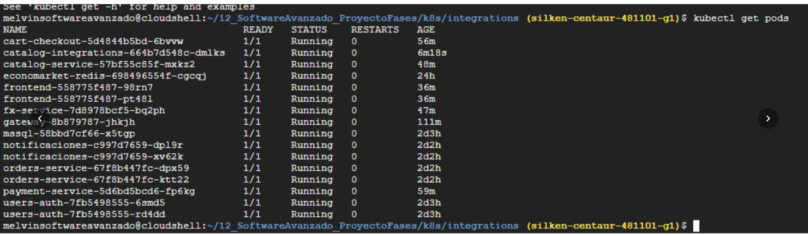
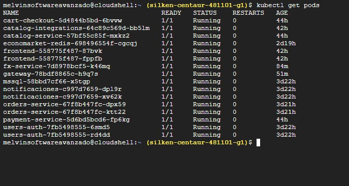

### 8.6 Estado de Services
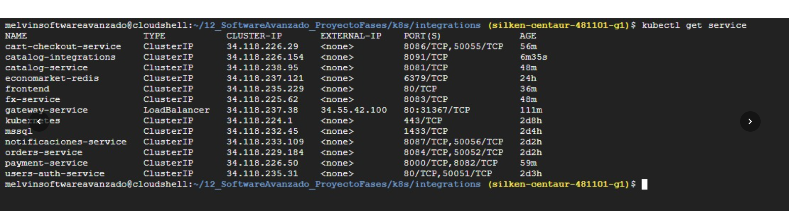
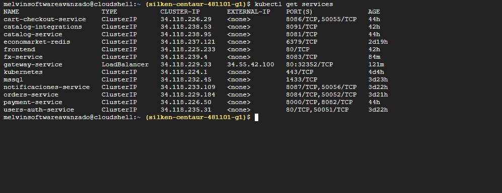
## 9. Conclusión

La arquitectura de **EconoMarket** cumple íntegramente con el apartado **3.6**,
presentando una solución segura, escalable y correctamente documentada,
respaldada por evidencias reales de funcionamiento en Kubernetes.
